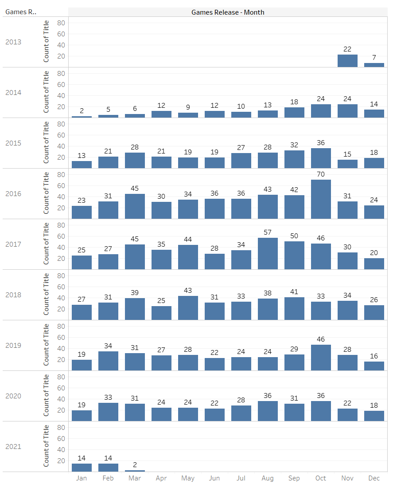
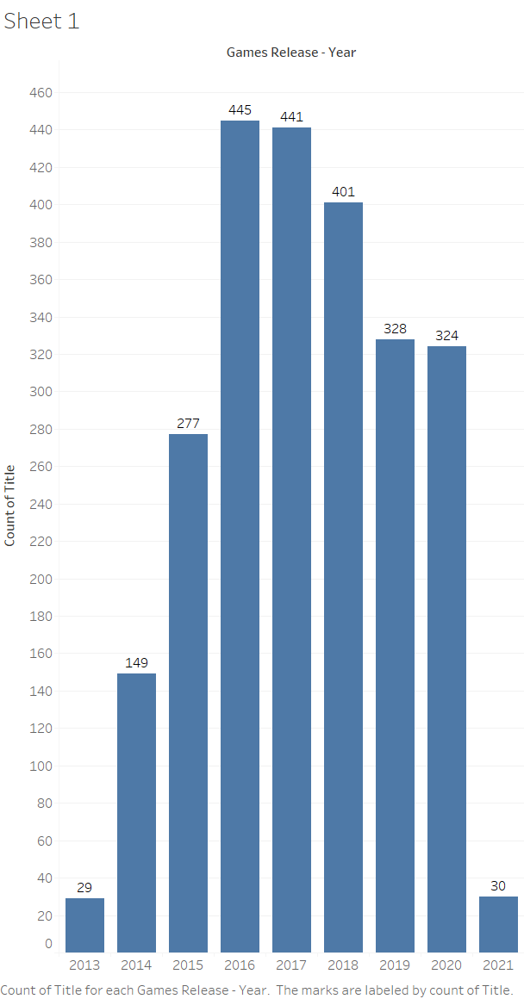
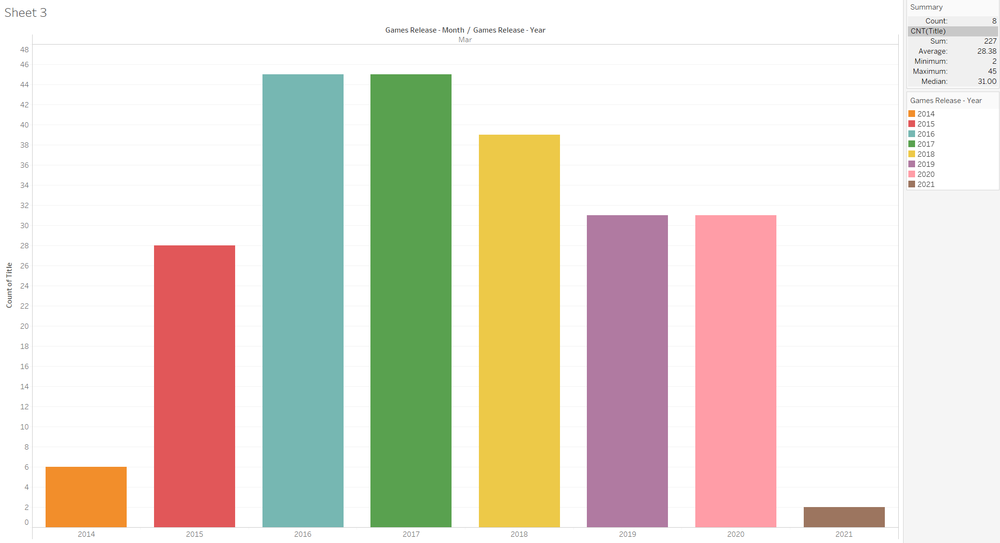

# Game_Recommender

## Abstract
Metacritic is the site for posting and gathering reviews on currently released video games. Using scrapping techniques I focued my efforts on gathering information on the prior generation consel PS4.

## Results
Using Cosine Similarty I created a simple content recommendation. 

## Analysis
intial inspection of Sony's PS4 releases show an average of 14 games released per month.
 

* From this Graph you can see how Sony has distributed thier releases for the consoles life. 

* Marh for each year has an intresting shape and similar distribution to the releaes per-year graph.

 

* futher investigation is required, but Hypothesis is the Microsft consol will have a similar Year and March distribution.

## Features
* Title:
* Meta_Score:
* User_Score:
* Game_Release_Date:
* Description: Summary, Multiplayer, Developer, Rating

### Output
Currently it outputs the 5 games similar to 'God of War'

### Improvements
* Implmenting a GUI in the next update
* Adding more Consoles in the next release
