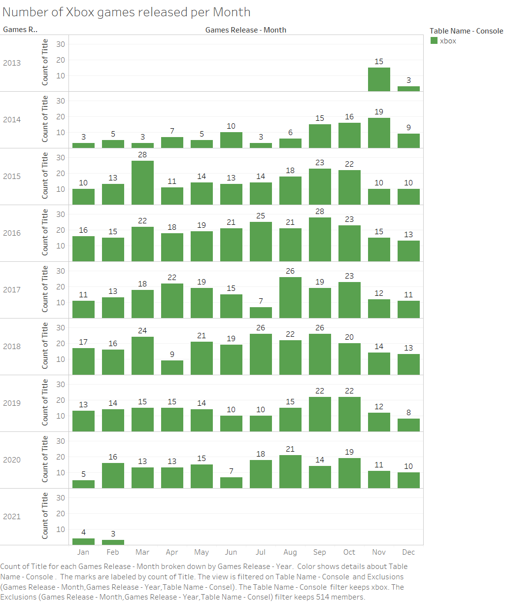
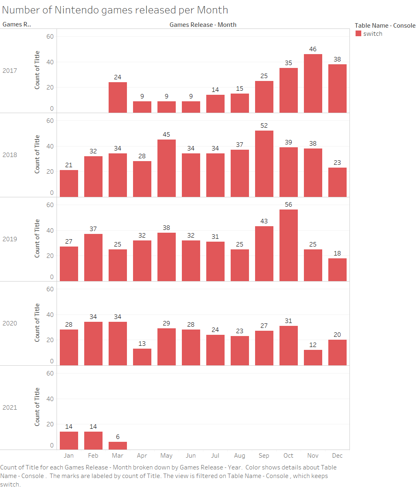

# Game_Recommender

## Abstract
Metacritic is the site for posting and gathering reviews on currently released video games. Using scrapping techniques I focued my efforts on gathering information on the prior generation consel PS4.

## Results
Using Cosine Similarty I created a simple content recommendation. I didn't feel comfortable taking individual user submited reviews, to build user simularity recomandations. 

## Analysis
* Intial inspection of Sony's PS4 console show an average of 25 games released per month.
* Average Critic score 69.9
* Average User score 6.3

* Intial inspection of Microsoft's Xbox console show an average of 15 games released per month.
* Average Critic score 70.8
* Average User score 6.4

* Intial inspection of Nintendo's Switch console show an average of 28 games released per month.
* Average Critic score 70.3
* Average User score 7.1

## Features
* Title:
* Meta_Score:
* User_Score:
* Game_Release_Date:
* Description: Summary, Multiplayer, Developer, Rating

### Output
Currently it outputs the 5 games similar to 'God of War'

### Improvements
* Implmenting a GUI in the next update

